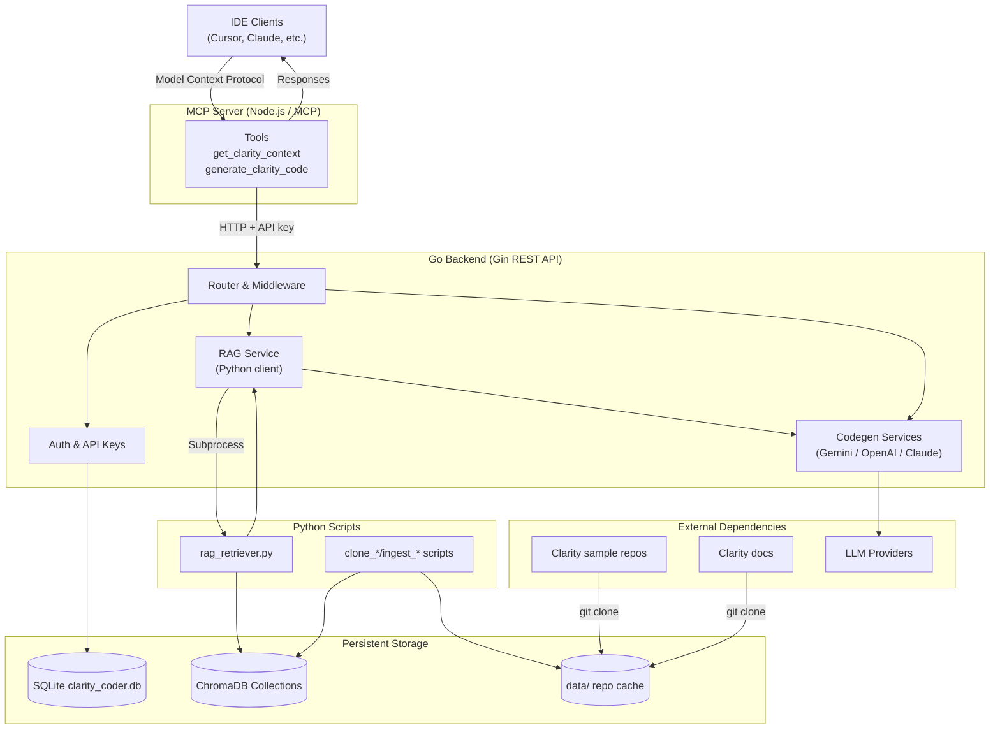

# Stacks Builder Architecture

This diagram shows how the IDE integrations, Go backend, Python retrieval layer, storage, and external services work together inside Stacks Builder.

```mermaid
graph TD
    IDE["IDE Clients<br/>(Cursor, Claude, etc.)"]

    subgraph MCP_Server["MCP Server (Node.js / MCP)"]
        tools["Tools<br/>get_clarity_context<br/>generate_clarity_code"]
    end

    subgraph Go_Backend["Go Backend (Gin REST API)"]
        router["Router & Middleware"]
        auth["Auth & API Keys"]
        rag["RAG Service<br/>(Python client)"]
        codegen["Codegen Services<br/>(Gemini / OpenAI / Claude)"]
    end

    subgraph Python_Layer["Python Scripts"]
        retriever["rag_retriever.py"]
        ingest["clone_*/ingest_* scripts"]
    end

    subgraph Data["Persistent Storage"]
        sqlite[("SQLite clarity_coder.db")]
        chroma[("ChromaDB Collections")]
        cache[("data/ repo cache")]
    end

    subgraph External["External Dependencies"]
        repos["Clarity sample repos"]
        docs["Clarity docs"]
        providers["LLM Providers"]
    end

    IDE -->|Model Context Protocol| tools
    tools -->|HTTP + API key| router
    router --> auth
    auth --> sqlite
    router --> rag
    rag -->|Subprocess| retriever
    retriever --> chroma
    ingest --> chroma
    ingest --> cache
    repos -->|git clone| cache
    docs -->|git clone| cache
    rag --> codegen
    codegen --> providers
    router --> codegen
    retriever --> rag
    tools -->|Responses| IDE
```
