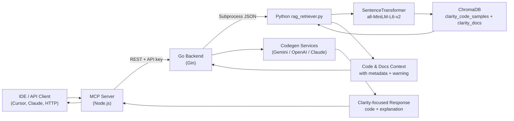
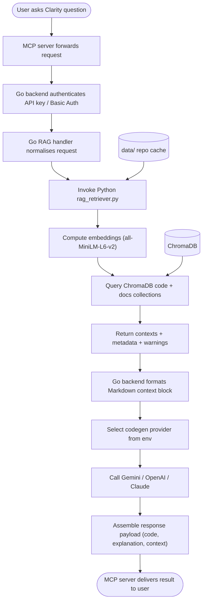
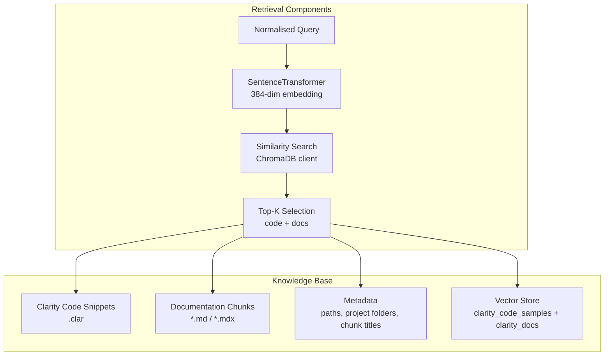
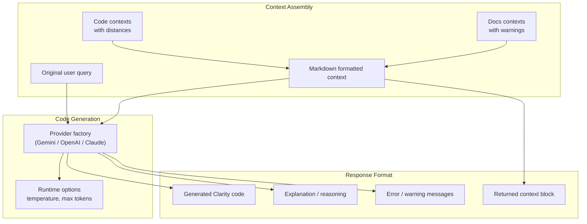

# RAG Approach for Clarity Coder

## Core RAG Architecture

## Detailed RAG Flow

## RAG Components Breakdown

### **1. Retrieval Phase**

### **2. Generation Phase**

## Key RAG Features

### **Enhanced Retrieval**
- **Code + Docs Coverage**: Retrieves Clarity `.clar` files and Markdown documentation chunks.
- **Metadata Enrichment**: Includes file paths, folders, warnings, and distance scores.
- **Semantic Search**: Embeddings powered by SentenceTransformer `all-MiniLM-L6-v2`.
- **Python Bridge**: Dedicated script encapsulates ChromaDB access and health checks.

### **Context Assembly**
- **Markdown Context Block**: Go backend returns a structured context payload for downstream tools.
- **Configurable Fan-out**: `n_results` validated across API and MCP tooling.
- **Warning Propagation**: Missing collections or ingest issues surface as warnings.
- **Reusable Service Layer**: Go RAG service exposes retrieval to both generation and retrieval endpoints.

### **Generation Quality**
- **Multi-provider Support**: Gemini, OpenAI, or Claude selected at runtime via env vars.
- **Parameter Handling**: Temperature and token limits forwarded from client requests.
- **Streaming-ready**: Go handlers structure responses for API and MCP clients.
- **Error Transparency**: Provider errors bubbled back with contextual messaging.

### **Benefits of This RAG Approach**

1. **Accurate Code Generation**: Responses stay grounded in retrieved Clarity code and docs.
2. **Project Awareness**: Metadata preserves folder structure and documentation context.
3. **Up-to-date Knowledge**: Ingestion scripts can refresh samples and docs on demand.
4. **Flexible Providers**: Swap LLM vendors without changing clients.
5. **Operational Visibility**: Warnings, logging, and health checks simplify troubleshooting.
