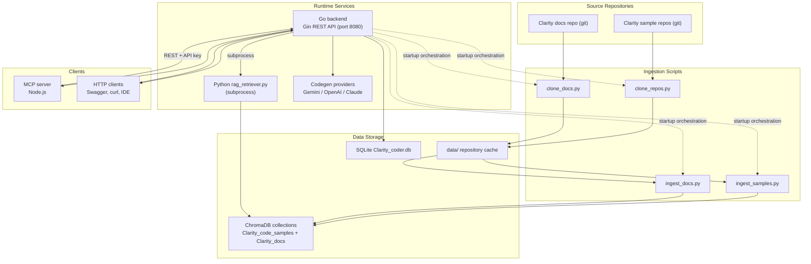
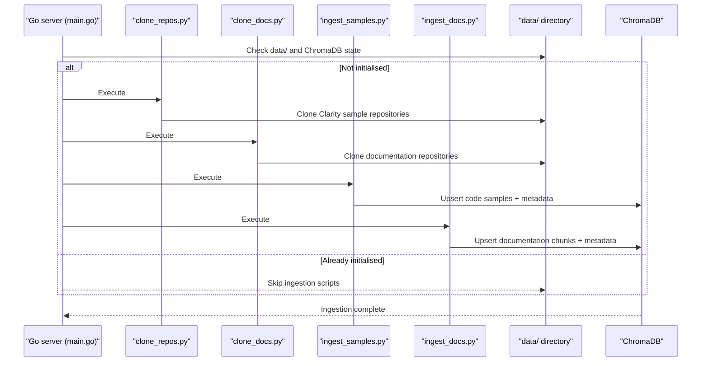
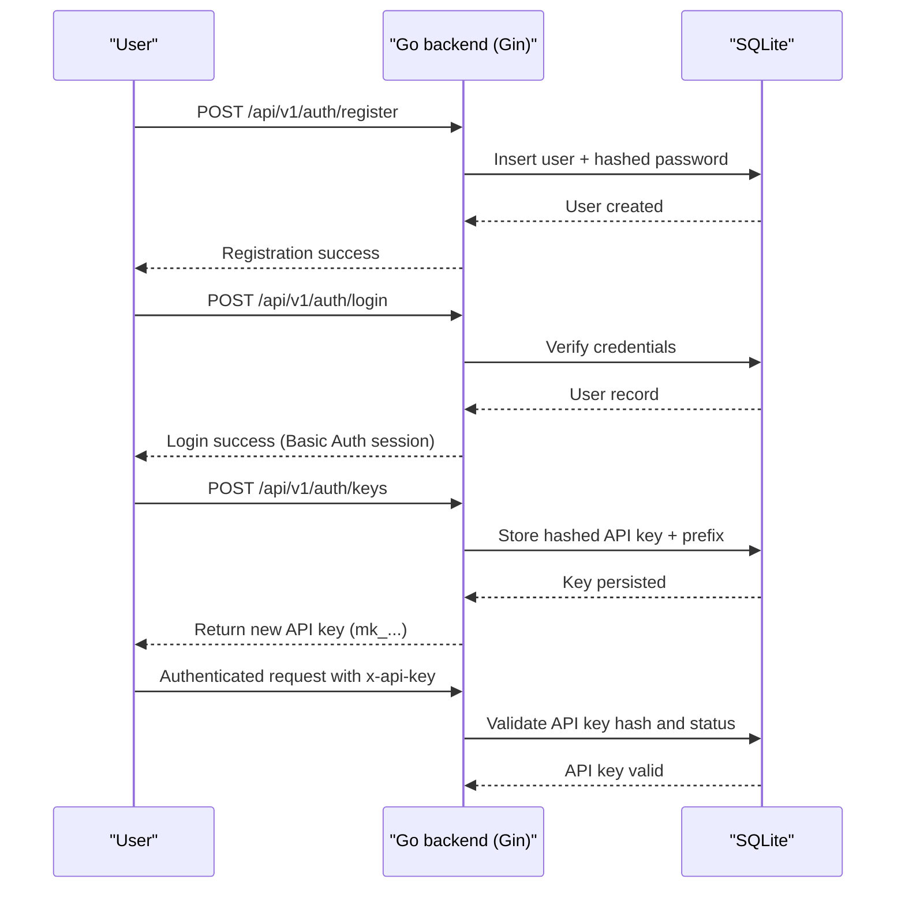
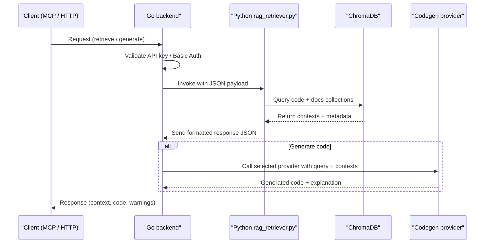

# Clarity Coder RAG Pipeline

## Complete System Architecture

## Detailed Process Flow

### 1. **Data Ingestion Phase**

### 2. **User Authentication & API Key Management**

### 3. **RAG Inference Process**

## Key Components Explained

### **Data Sources**
- **Clarity Sample Repositories**: Cloned into `data/` via `clone_repos.py`
- **Official Documentation**: Cloned into `data/` via `clone_docs.py`
- **Environment Configuration**: `.env` values drive script paths, database location, and provider choice

### **Ingestion Pipeline**
- **Repository Cloning**: Python scripts mirror upstream code and docs on first run
- **Sample Ingestion**: `ingest_samples.py` parses `.clar` files and `Clarinet.toml`, capturing metadata such as folder hierarchy and TOML presence
- **Documentation Ingestion**: `ingest_docs.py` chunks Markdown content with titles, indices, and source metadata
- **Embedding Generation**: SentenceTransformer `all-MiniLM-L6-v2` creates 384-dimensional vectors stored in ChromaDB

### **Vector Database (ChromaDB)**
- **Collections**: `clarity_code_samples` and `clarity_docs`
- **Documents**: Raw code snippets, TOML manifests, and documentation chunks
- **Metadata**: File paths, folder arrays, chunk titles, warning flags
- **Distances**: Cosine similarity scores returned to the Go backend for ranking

### **API System**
- **Unified Go Service**: Exposes `/api/v1/auth`, `/api/v1/rag`, and `/v1/chat/completions` on port 8080
- **Middleware**: Basic Auth for ingestion endpoints, API key authentication for RAG and chat routes
- **SQLite Database**: Stores users, API keys, and ingestion job metadata
- **Auto-initialisation**: `main.go` triggers cloning and ingestion scripts when `data/` is empty

### **RAG Inference**
- **Query Normalisation**: Go handler validates payload and defaults `n_results`
- **Python Bridge**: Backend executes `rag_retriever.py` with stdin/stdout JSON to retrieve contexts
- **Context Formatting**: Responses include Markdown-ready sections for code and docs plus warnings when applicable
- **Code Generation**: Provider factory selects Gemini, OpenAI, or Claude based on `CODEGEN_PROVIDER`

### **Client Integration**
- **Node MCP Server**: Tools `get_clarity_context` and `generate_clarity_code` consume the Go API
- **Swagger / HTTP Clients**: Developers can test via Swagger UI or standard REST clients
- **OpenAI-Compatible SDKs**: `/v1/chat/completions` mirrors the OpenAI API for easy adoption
- **Automation**: Make targets orchestrate Docker containers, ingestion, and cleanup

## Benefits of This Architecture

1. **Full Clarity Coverage**: Combines sample code, manifests, and official documentation for grounded answers
2. **Self-Initialising**: Backend bootstraps data ingestion automatically while supporting manual control via Make
3. **Security Built-In**: Basic Auth for privileged operations and hashed API keys for user access
4. **Provider Flexibility**: Swap between Gemini, OpenAI, and Claude without client changes
5. **MCP Ready**: Seamless IDE integration through the Node MCP server alongside standard REST workflows
